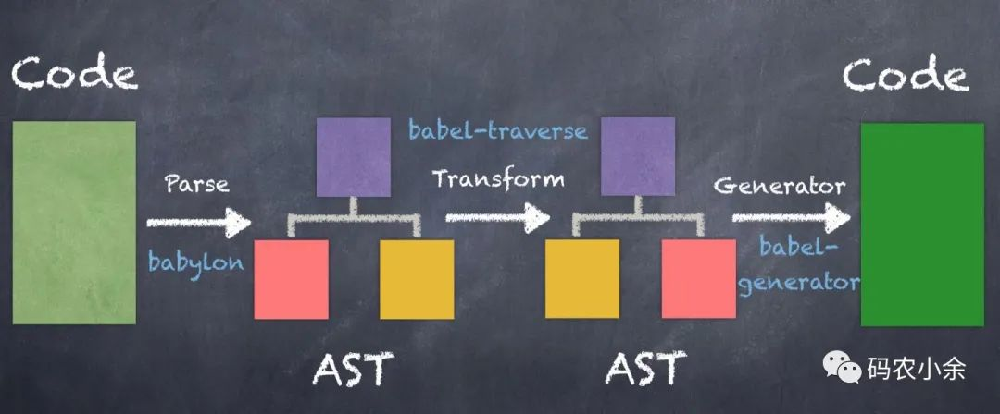

## Babel 编译的三个阶段

`Babel` 是一个 `JavaScript` `TypeScript` 编译器

Babel 的编译过程可分为三个阶段

- 解析 `Parse`: 将代码解析成`AST` 抽象语法树,就是对`JS`代码进行语法分析和词法分析

- 转换 `Transform`: 对抽象语法树进行转换操作，主要是添加、移除以及更新

- 生成 `Generate`: 根据变换后的抽象语法树再生成代码字符串

### Parse 解析

`Babel` 会把源代码抽象出来，变成 `AST`。

`AST` 移步下一篇

### 转换 Transform

插件应用于 Babel 的转译过程。如果不使用任何插件，那么 Babel 会原样输出代码。

### 生成 Generate

用 babel-generator 通过 AST 树生成 ES5 代码。

## 实现一个简单的按需打包功能

`ElementUI` 中把 import { Button } from 'element-ui' 转成 import Button from 'element-ui/lib/button'

    // import { Button } from 'element-ui'
    {
        "type": "Program",
        "body": [        
             {   "type": "ImportDeclaration",            
                 "specifiers": [
                     { 
                        "type": "ImportSpecifier",                    
                        "local": {                        
                                "type": "Identifier",                       
                                 "name": "Button"                    
                            },                    
                        "imported": {                        
                                "type": "Identifier",                        
                                "name": "Button"                   
                             }                
                    }            
                ],            

            "source": {                
                    "type": "Literal",                
                    "value": "element-ui",                
                    "raw": "'element-ui'"            
                }        
            }   
        ],
        "sourceType": "module"
    }

    // import Button from 'element-ui/lib/button'

    {
        "type": "Program",
        "body": [        
             {   "type": "ImportDeclaration",            
                 "specifiers": [
                     {                   
                         "type": "ImportDefaultSpecifier",                    
                         "local": {                        
                                "type": "Identifier",                        
                                "name": "Button"                   
                             }                
                        }

                ],            

            "source": {               
                 "type": "Literal",               
                 "value": "element-ui/lib/button",                
                "raw": "'element-ui/lib/button'"            
            }

            }   
        ],
        "sourceType": "module"
    }

specifiers 的 type 和 source 的 value、raw 不同

ElementUI 官方文档中，babel-plugin-component 的配置如下：

    // 如果 plugins 名称的前缀为 'babel-plugin-'，你可以省略 'babel-plugin-' 部分
    {  "presets": [
            ["es2015", { "modules": false }]
        ],  
        "plugins": [    
            [      "component",      
                    {        
                        "libraryName": "element-ui",        
                        "styleLibraryName": "theme-chalk"      
                    }   
            ]  
        ]
    }

直接干

    import * as babel from '@babel/core'

    const str = `import { Button } from 'element-ui'`
    const { result } = babel.transform(str, {
        plugins: [
            function({types: t}) {
                return {
                     visitor: {
                          ImportDeclaration(path, { opts }) {
                              const { node: { specifiers, source } } = path
                               // 比较 source 的 value 值 与配置文件中的库名称
                                if (source.value === opts.libraryName) {
                                    const arr = specifiers.map(specifier => (
                                        t.importDeclaration(
                                            [t.ImportDefaultSpecifier(specifier.local)],
                                            // 拼接详细路径
                                            t.stringLiteral(`${source.value}/lib/${specifier.local.name}`)
                                         )
                                    ))
                                    path.replaceWithMultiple(arr)
                                }
                            }
                        }
                    }
                }
        ]
    }
