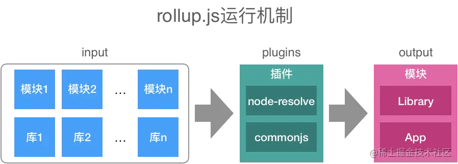

`rollup.js`是Javascript的ES模块打包器，我们熟知的`Vue`、`Reac`t等诸多知名框架或类库都通过`rollup.js`进行打包。与`Webpack`偏向于应用打包的定位不同，`rollup.js`更专注于Javascript类库打包（虽然rollup.js也可以提供资源打包，但显然这不是它的强项）。在我们学习Vue和React等框架源码或者自己编写Javascript类库时，rollup.js是一条必经之路。

优点

- 不像webpack 配置比较繁琐
- ejs 模式自动tree shaking
- 不会像webpack一样打包生成很多多余代码(webpack自定的require,factory函数等)

常用来打包公共js库

## rollup.js的工作原理

rollup.js可以将我们自己编写的Javascript代码（通过插件可以支持更多语言，如Tyepscript）与第三方模块打包在一起，形成一个文件，该文件可以是一个库（Library）或者一个应用（App），在打包过程中可以应用各类插件实现特定功能。下图揭示了rollup.js的运行机制：

## 安装rollup.js

    npm i rollup -g //全局安装

通过rollup.config.js来配置rollup的打包规则, 使用的是esm语法

`input:` 入口文件地址

`output:`

    output: {
        file: 'bundles.js' // 输出文件
        format: 'cjs' // 输出格式: cjs, umd, iife, es6, amd
        // format为iife或者umd的时候必须配置, 会作为全局变量
        // name: 'woyaoUtil',
        sourcemap: true // 生成源码映射文件
    }

- amd – 异步模块定义，用于像RequireJS这样的模块加载器
- cjs – CommonJS，适用于 Node 和 Browserify/Webpack
- esm – 将软件包保存为 ES 模块文件，在现代浏览器中可以通过 `<script type=module>` 标签引入
- iife – 一个自动执行的功能，适合作为`<script>`标签。（如果要为应用程序创建一个捆绑包，您可能想要使用它，因为它会使文件大小变小。）
- umd – 通用模块定义，以amd，cjs 和 iife 为一体
- system - SystemJS 加载器格式

`plugins`:

    plugins: [
        resolve(),
        commonjs()
    ]
    // rollup typescript配置处理
    `@rollup/plugin-typescript`
    /*
    * 帮助寻找node_modules里的包
    * rollup.js编译源码中的模块引用默认只支持ES6+的模块方式import/export。
    * 然而大量的npm模块是基于CommonJS模块方式，这就导致了大量 npm 模块不能直接编译使用。
    * 所以辅助rollup.js编译支持npm模块和CommonJS模块方式的插件就应运而生
    */
    `@rollup/plugin-node-resolve`
    // 支持import 'xx.json'文件
    `@rollup/plugin-json`
    // 在打包的时候把目标字符串替换å
    `@rollup/plugin-replace`
    // 对打包的js进行压缩
    `rollup-plugin-terser`
    // 删除原来的bundle
    `rollup-plugin-delete`
    // 显示打包后文件的大小
    `rollup-plugin-filesize`
    // 将CommonJs语法转成es5
    `rollup-plugin-commonjs`
    // rollup 的 babel 插件，ES6转ES5
    `rollup-plugin-babel`

`external`

告诉rollup不要把第三方库进行打包，而是作为外部依赖, 配合”peerDependencies“使用， 这样业务代码引入我们的公共库的时候避免了重复下载

    // 第三方esm 语法的包
    const external = [/lodash-es\/[a-z]+/, 'ts-date', 'classnames']
    // 第三方cjs 语法的包
    const cjsExteranl = ['classnames']

`global`

    globals: {
            'react': 'React',
            'react-dom': 'ReactDOM'
    }

package.json中需要注意的点:

    "module" // 打包的esm规范的bundle设置入口
    "peerDependencies" // 第三方库应该在这里强调依赖的版本
    "scripts": {
        "build": "rollup -c",
        "build:dev": "npm run clean && env_type=development npm run build",
        "build:prod": "npm run clean && env_type=production npm run build",
        "clean": "rimraf umd"
    }

生成umd bundle的例子

    import nodeResolve from '@rollup/plugin-node-resolve'
    import replace from '@rollup/plugin-replace'
    import { terser } from 'rollup-plugin-terser'
    import filesize from 'rollup-plugin-filesize'
    import commonjs from '@rollup/plugin-commonjs'
    import { babel } from '@rollup/plugin-babel'

    const env = process.env.env_type
    const isProdEnv = env === 'production'

    const config = {
        input: 'src/index.js',
        external: ['react', 'react-dom'],
        output: {
            name: 'WoyaoUtil',
            file: 'umd/woyao-util.js',
            format: 'umd',
            sourcemap: true
        }
    }

    const plugins = [
        nodeResolve(),
        babel({
            exclude: '**/node_modules/**',
            babelHelpers: 'bundled'
        }),
        isProdEnv && filesize(),
        replace({
            'process.env.NODE_ENV': JSON.stringify(env)
        }),
        commonjs(),
        isProdEnv && terser()
    ].filter(Boolean)

    config.plugins = plugins

    export default config

`babelHelpers`

Type: 'bundled' | 'runtime' | 'inline' | 'external'

Default: 'bundled'

- 'runtime' - 如果你要用rollup构建一个js包的时候，使用该配置，该配置要结合@babel/plugin-transform-runtime插件使用，使用@babel/plugin-transform-runtime也要安装@babel/runtime插件
- 'bundled' - 如果用rollup构建一个项目的用此参数
- 'inline' 官网不推荐使用，会导致很多重复性代码
- 'external' 要结合@babel/plugin-external-helpers插件使用，它会把helpers 收集到一个共享模块，我的理解是相当于runtime和bundled一个集合，就是把helpers 抽到一个全局的共享模块但是又不会造成全局的污染

babel需要作如下配置:

    {
        "presets": [
            [
                "@babel/preset-env",
                {
                    // 设置为false, 否则babel会在rollup有机会执行其操作之前导致我们的模块转化为commonjs
                    "modules": false,
                // polyfill按需引入
                    "useBuiltIns": "usage",
                    "corejs": 3
                }
            ],
            "@babel/preset-react"
        ]
    }

不过我们实际开发并不会打包成umd格式的文件，因为umd格式的包文件很大。

一般会分开打包一个cjs包和一个es包。然后把cjs包写进package.json的main属性，

把es包写进package.json的module属性

## typescript 配置

需要安装下面几个包:

- typescript
- @rollup/plugin-typescript
- tslib

例子

    import typescript from '@rollup/plugin-typescript'

     const plugins = [
        typescript({
            declaration: false
        }),
        nodeResolve(),
        commonjs(),
        replace({
            'process.env.NODE_ENV': JSON.stringify(env)
        }),
        babel({
            exclude: '**/node_modules/**',
            babelHelpers: 'bundled'
        }),
        isProdEnv && filesize(),
        isProdEnv && terser()
    ].filter(Boolean)

typescript的配置文件tsconfig.json一般如下:

    {
        "compilerOptions": {
            "allowUnreachableCode": true, // 不报告执行不到的代码错误。
            "allowUnusedLabels": false, // 不报告未使用的标签错误
            "alwaysStrict": false, // 以严格模式解析并为每个源文件生成 "use strict"语句
            "baseUrl": ".", // 工作根目录
            "experimentalDecorators": true, // 启用实验性的ES装饰器
            "jsx": "react", // 在 .tsx文件里支持JSX
            "sourceMap": true, // 是否生成map文件
            "module": "ES2015", // 指定生成哪个模块系统代码
            "noImplicitAny": false, // 是否默认禁用 any
            "removeComments": true, // 是否移除注释
            "target": "ESNext", // 编译的目标是什么版本的
            "outDir": "./dist", // 输出目录
            "declaration": true, // 是否自动创建类型声明文件
            "declarationDir": "./ts/lib", // 类型声明文件的输出目录
            "allowJs": true, // 允许编译javascript文件。
            "moduleResolution": "node",
            "allowSyntheticDefaultImports": true,
            "lib": [ // 编译过程中需要引入的库文件的列表
                "es5",
                "es2015",
                "es2016",
                "es2017",
                "es2018",
                "dom"
            ]
        },
        // 指定一个匹配列表（属于自动指定该路径下的所有ts相关文件）
        "include": [
            "src/**/*"
        ],
        // 指定一个排除列表（include的反向操作）
        "exclude": [
            "node_modules",
            "dist"
        ]
    }

## 编译css

rollup-plugin-postcss

    import postcss from 'rollup-plugin-postcss'

    const plugins = [
        typescript(),
        nodeResolve(),
        commonjs(),
        replace({
            'process.env.NODE_ENV': JSON.stringify(env)
        }),
        babel({
            exclude: '**/node_modules/**',
            babelHelpers: 'bundled'
        }),
        postcss(),
        isProdEnv && filesize(),
        isProdEnv && terser()
    ].filter(Boolean)

## 开启本地服务器

    npm install rollup-plugin-serve --save-dev

记得配置sourcemap: true,这样调试代码方便。

    import babel from '@rollup/plugin-babel'
    import resolve from '@rollup/plugin-node-resolve'
    import typescript from '@rollup/plugin-typescript'
    import commonjs from '@rollup/plugin-commonjs'
    import { terser } from 'rollup-plugin-terser'
    import postcss from 'rollup-plugin-postcss'
    import serve from 'rollup-plugin-serve'
    import livereload from 'rollup-plugin-livereload'

    export default {
    input: './src/main',
    output: {
        file: './dist/bundle.js',
        format: 'cjs',
        name: 'bundleName',
        sourcemap: true
    },
    plugins: [
        typescript(),
        resolve(),
        commonjs(),
        babel({
            exclude: 'node_modules/**'
        }),
        terser(),
        postcss(),
        livereload(),
        serve({
            open: true,
            contentBase: 'dist'
        })
    ],
    external: ['lodash']
    }

    npm install rollup-plugin-livereload --save-dev
    热更新

    "scripts": {
        "build": "rollup --config",
        "dev": "rollup --config -w"
    },