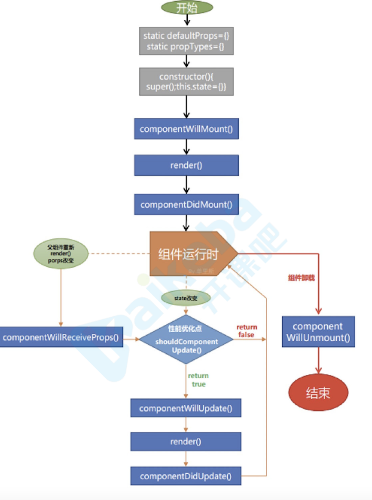
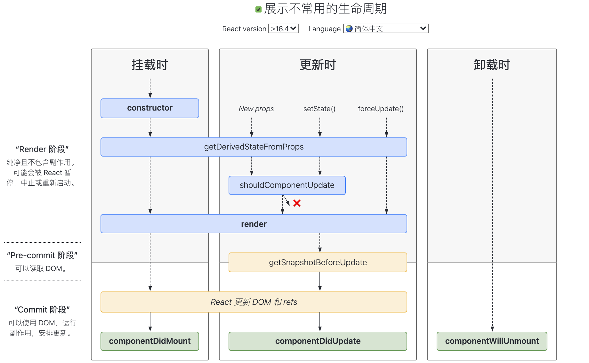

## 起步

1. 创建项目 npx create-react-app myapp
2. 打开项目: cd my-app
3. 启动项目: npm start
4. 暴露配置项: npm run eject 此方法不可逆

### 使用第三方组件

- 安装: npm install antd --save
- 配置按需加载

通过react脚手架create-react-app创建了项目，但是发现了一个问题 如果没有执行eject命令的话 是没有其他配置文件的 这个时候就需要 用到 customize-cra 和 react-app-rewired插件
然后在根目录下新建一个名称为config-overrides.js的文件。在里面去进行所有的配置

`react-app-rewired的作用就是在不eject的情况下,覆盖create-react-app的配置`

babel-plugin-import 是一个用于按需加载组件代码和样式的 babel 插件
    //引入
    const { injectBabelPlugin } =require('react-app-rewired');
    //使用
    module.exports =function override(config, env){
            config= injectBabelPlugin(['import', 
            { libraryName:'antd', style:true}],config);
            return config;
    };

安装 react-app-rewired 取代 react-scripts，可扩展 webpack 的配置 ，类似 vue.config.js

    npm install react-app-rewired customize-cra babel-plugin-import -D

     //根目录创建config-overrides.js
    const { override, fixBabelImports } = require("customize-cra");
    module.exports = override(
    fixBabelImports("import", {
        libraryName: "antd",
        libraryDirectory: "es",
        style: "css"
    }) );

    //修改package.json 
    "scripts": {
        "start": "react-app-rewired start",
        "build": "react-app-rewired build",
        "test": "react-app-rewired test",
        "eject": "react-app-rewired eject"
    },

- 使用组件

  import {Button} from 'antd'

- 使用sass

    安装 npm install  node-sass --save-dev

因为create-react-app已经默认已经添加了scss/sass对应的loader，所以在安装完之后就可以在项目中使用scss了，详见配置可以参考\node_modules\react-scripts。

- 全局配置scss变量/函数

在用scss预处理器的时候，会常用变量/函数/混合等功能。目前如果想要使用变量/函数的话需要在每个文件中单独引入，这样明显不合理，我们需要的是引入一次，所以我们就需要定义全局主题的样式变量，也就是利用sass-resources-loader这个loader将scss变量打包到每个文件中。首先我们要安装sass-resources-loader。

    npm install --save-dev sass-resources-loader

不暴露配置文件情况下配置

    const { override, adjustStyleLoaders } = require("customize-cra");
    module.exports = override(
    // ...其他配置...
        adjustStyleLoaders(rule => {
            if (rule.test.toString().includes("scss")) {
            rule.use.push({
                loader: require.resolve("sass-resources-loader"),
                options: {
                resources: "./src/assets/scss/output.scss" //这里是你自己放公共scss变量的路径
                }
            });
            }
    })
    );
    
### 使用ESLint+Prettier来统一前端代码风格

编辑器vscode，并且已经安装好eslint和prettier插件
ESLint 进行代码的校验 Prettier 保持代码风格统一

npm i -D prettier  新建.eslintrc.js并在package.json里面删除eslintConfig

配合ESLint检测代码风格 npm i -D eslint-plugin-prettier

eslint-plugin-prettier插件会调用prettier对你的代码风格进行检查，其原理是先使用prettier对你的代码进行格式化，然后与格式化之前的代码进行对比，如果过出现了不一致，这个地方就会被prettier进行标记。

接下来，我们需要在rules中添加，"prettier/prettier": "error"，表示被prettier标记的地方抛出错误信息

    //.eslintrc.js
    {
    "plugins": ["prettier"],
    "rules": {
        "prettier/prettier": "error"
    }
    }

如果与已存在的插件冲突怎么办

npm i -D eslint-config-prettier

通过使用eslint-config-prettier配置，能够关闭一些不必要的或者是与prettier冲突的lint选项。这样我们就不会看到一些error同时出现两次。使用的时候需要确保，这个配置在extends的最后一项

    //.eslintrc.js
    {
        extends: [
            'standard', //使用standard做代码规范
            "plugin:prettier/recommended",
            "prettier",
        ],
    
    }

新建.prettierrc.js并添加

    {
    semi: true,
    trailingComma: 'all',
    singleQuote: true,
    printWidth: 120,
    tabWidth: 4,
    }

添加commit命令 npm install --save lint-staged husky
修改package.json

    "lint-staged": {
        "*.+(js|jsx)": [
            "eslint --fix",
            "git add"
        ],
        "*.+(json|css|md)": [
            "prettier --write",
            "git add"
        ]
    },
    "husky": {
        "hooks": {
            "pre-commit": "lint-staged"
        }
    },

### cra ⽂件结构

    ├── README.md             文档
    ├── public                静态资源
    │ ├── favicon.ico
    │ ├── index.html
    │ └── manifest.json
    └── src                   源码
    ├── App.css
    ├── App.js                根组件
    ├── App.test.js
    ├── index.css             全局样式
    ├── index.js              入⼝文件
    ├── logo.svg
    └── serviceWorker.js      pwa 支持
    ├── package.json          npm 依赖

### ⼊口文件定义，webpack.config.js

    entry: [
    // WebpackDevServer 客户端，它实现开发时热更更新功能
    isEnvDevelopment && require.resolve('react-dev-utils/webpackHotDevClient'),
    // 应⽤用程序⼊入⼝口:src/index
    paths.appIndexJs,
    ].filter(Boolean),

webpack.config.js 是 webpack 配置⽂文件，开头的常量量声明可以看出 cra 能够⽀支持 ts、sass 及 css 模块化

    // Check if TypeScript is setup
    const useTypeScript = fs.existsSync(paths.appTsConfig);
    // style files regexes
    const cssRegex = /\.css$/;
    const cssModuleRegex = /\.module\.css$/;
    const sassRegex = /\.(scss|sass)$/;
    const sassModuleRegex = /\.module\.(scss|sass)$/;

### React 和 ReactDom

    import React from 'react';
    import ReactDOM from 'react-dom';
    // 这⾥里里怎么没有出现React字眼?
    // JSX => React.createElement(...)
    ReactDOM.render(<h1>Hello React</h1>, document.querySelector('#root'));
    React负责逻辑控制，数据 -> VDOM
    ReactDom渲染实际DOM VDOM -> DOM
    React使⽤用JSX来描述UI
    babel-loader把JSX 编译成相应的 JS 对象，
    React.createElement再把这个JS对象构造成React需 要的虚拟dom。

### JSX 语法

JSX 是一种 JavaScript 的语法扩展，其格式比较像模版语言，但事实上完全 是在 JavaScript 内部实现的。
 
JSX 可以很好地描述 UI，能够有效提高开发效率，体验 [JSX](https://zh-hans.reactjs.org/)

#### 基本使用

表达式{}的使用，index.js

    const name = "react study";
    const jsx = 
hello, {name}
;

#### 函数

函数也是合法表达式，index.js

    const user = {
        fistName: "Harry",
        lastName: "Potter"
    };
    function formatName(name) {
        return name.fistName + " " + name.lastName;
    }
    const jsx = 
{formatName(user)}
;

#### 对象

jsx 是 js 对象，也是合法表达式，index.js

    const greet = 
good
;
    const jsx = 
{greet}
;

#### 条件语句

条件语句可以基于上面结论实现，index.js

    const show = true;//false;
    const greet = 
good
;
    const jsx = (
    

    // 条件语句
    {show ? greet : "登录"} {show && greet}
    

    );

#### 数组

数组会被作为一组子元素对待，数组中存放一组 jsx 可用于显示列表数据

    const a = [0, 1, 2];
    const jsx = (
    

     //数组
      <ul>
    //diff 时候，首先比较 type，然后是 key，所以同级同类型元素， key 值必须得 唯一
    {a.map(item => (
    <li key={item}>{item}</li>
    ))}
    </ul> 

    );

#### 属性的使用

    import logo from "./logo.svg";

    const jsx=(
        
    )

#### 模块化

css 模块化，创建 index.module.css，index.js

    import style from "./index.module.css";
    

或者 npm install sass -D

    import style from "./index.module.scss";
    

## setState

setState(partialState, callback)

1. partialState:object|function
    
   ⽤于产⽣与当前 state 合并的子集。
2. callback:function
    
   state 更更新之后被调⽤用。

### 关于 setState() 你应该了了解三件事:

1.不要直接修改 State

    //此代码不会重新渲染组件:
    this.state.name='erdang'
    //正确
    this.setState({name:'erdang'})

2.State 的更更新会被合并

**出于性能考虑，React 可能会把多个 setState() 调用合并成⼀个调用**

批量操作：对同一个 key 多次操作会合并，会执行最后一次

    changeValue = v => {
        this.setState({
            counter: this.state.counter + v
        });
    };
    setCounter = () => {
        this.changeValue(1);
        this.changeValue(2);
    };

    如果想要链式更更新state:

    changeValue = v => {
        this.setState(state => ({ counter: state.counter + v }));
    };
    setCounter = () => {
        this.changeValue(1);
        this.changeValue(2);
    };

3.State 的更新可能是异步的

    class Clock extends Component {

    state = { date: new Date(), counter: 1 };

    componentDidMount() {
        this.timer = setInterval(() => {
        //   setState修改状态
        this.setState({ date: new Date() });
        }, 1000);

        // 批量操作：对同一个key多次操作会合并，会执行最后一次
        this.setState({ counter: this.state.counter + 1 });
        this.setState({ counter: this.state.counter + 1 });
        this.setState({ counter: this.state.counter + 1 }, ()=>{
            console.log('cb'+this.state.counter); // 2 在回调中获取状态值
        });
        console.log(this.state.counter); // 1

        this.setState(prev => {
        console.log(prev.counter); // 2
        return prev.counter;
        });

        setTimeout(() => {
            console.log(this.state.counter); // 2 使⽤用定时器器:
        }, 0);

        document.body.addEventListener("click", this.changeCounter); //原⽣生事件中修改状态
    }

    changeCounter = () => {
        this.setState({ counter: this.state.counter + 1 });
        console.log(this.state.counter); // 3
    };

    componentWillUnmount() {
        clearInterval(this.timer);
    }

    render() {
        return (
        

            {this.state.date.toLocaleTimeString()}
            
{this.state.counter}

        

        );
    }
    }

如果要获取到最新状态值有以下⽅方式:

1. 在回调中获取状态值
2. 使⽤用定时器器:
3. 原⽣事件中修改状态

setState 只有在合成事件和⽣命周期函数中是异步的，react 基本都是合成事件 
在原⽣事件和 setTimeout 中都是同步 的，这⾥的异步其实是批量更新。

## 生命周期

### React V16.3 之前的生命周期

### React V16.4 之后的生命周期

引入两个新的生命周期
static getDerivedStateFromProps  
getSnapshotBeforeUpdate

#### 挂载

当组件实例被创建并插入 DOM 中时，其生命周期调用顺序如下：

    1.constructor()
    2.static getDerivedStateFromProps()
    3.render()
    4.componentDidMount()

::: tip
下述生命周期方法即将过时，在新代码中应该避免使用它们：
UNSAFE_componentWillMount()
:::

#### 更新

当组件的 props 或 state 发生变化时会触发更新。组件更新的生命周期调用顺序如下：

    1.static getDerivedStateFromProps()
    2.shouldComponentUpdate()
    3.render()
    4.getSnapshotBeforeUpdate()
    5.componentDidUpdate()

::: tip
下述方法即将过时，在新代码中应该避免使用它们： 
UNSAFE_componentWillUpdate() 
UNSAFE_componentWillReceiveProps()
:::

#### 卸载

当组件从 DOM 中移除时会调用如下方法：

    componentWillUnmount()

#### 错误处理

当渲染过程，生命周期，或子组件的构造函数中抛出错误时，会调用如下方法：

    static getDerivedStateFromError()
    componentDidCatch()

### render()

class 组件中唯一必须实现的方法。 
render() 函数应该为纯函数，这意味着在不修改组件 state 的情况下， 
每次调用时都返回相同的结果，并且它不会直接与浏览器交互。

:::tip
如果 shouldComponentUpdate() 返回 false，则不会调用 render()
:::

### constructor()

在 React 组件挂载之前，会调用它的构造函数。 
在为 React.Component 子类实现构造函数时，应在其他语句之前前调用 super(props)。 
否则，this.props 在构造函数中可能会出现未定义的 bug 

通常，在 React 中，构造函数仅用于以下两种情况： 

1.通过给 this.state 赋值对象来初始化内部 state。  2.为事件处理函数绑定实例

    constructor(props) {
    super(props);
    // 不要在这里调用 this.setState()
    this.state = { counter: 0 };
    this.handleClick = this.handleClick.bind(this);
    }

### componentDidMount()

componentDidMount() 会在组件挂载后（插入 DOM 树中）立即调用。依赖于 DOM 节点的初始化应该放在这里。如需通过网络请求获取数据，此处是实例化请求的好地方。

这个方法是比较适合添加订阅的地方。如果添加了订阅，请不要忘记在 componentWillUnmount() 里取消订阅

你可以在 componentDidMount() 里直接调用 setState()。它将触发额外渲染，但此渲染会发生在浏览器更新屏幕之前。如此保证了即使在 render() 两次调用的情况下，用户也不会看到中间状态。请谨慎使用该模式，因为它会导致性能问题。通常，你应该在 constructor() 中初始化 state。如果你的渲染依赖于 DOM 节点的大小或位置，比如实现 modals 和 tooltips 等情况下，你可以使用此方式处理

### componentDidUpdate()

    componentDidUpdate(prevProps, prevState, snapshot)

componentDidUpdate() 会在更新后会被立即调用。首次渲染不会执行此方法

当组件更新后，可以在此处对 DOM 进行操作。如果你对更新前后的 props 进行了比较，也可以选择在此处进行网络请求。（例如，当 props 未发生变化时，则不会执行网络请求）。

    componentDidUpdate(prevProps) {
    // 典型用法（不要忘记比较 props）：
        if (this.props.userID !== prevProps.userID) {
            this.fetchData(this.props.userID);
        }
    }

如果组件实现了 getSnapshotBeforeUpdate() 生命周期（不常用），则它的返回值将作为 componentDidUpdate() 的第三个参数 “snapshot” 参数传递。否则此参数将为 undefined。

### componentWillUnmount()

componentWillUnmount() 会在组件卸载及销毁之前直接调用。在此方法中执行必要的清理操作，例如，清除 timer，取消网络请求或清除在 componentDidMount() 中创建的订阅等。

### shouldComponentUpdate()

    shouldComponentUpdate(nextProps, nextState)

根据 shouldComponentUpdate() 的返回值，判断 React 组件的输出是否受当前 state 或 props 更改的影响。 
默认行为是 state 每次发生变化组件都会重新渲染。大部分情况下，你应该遵循默认行为。 

当 props 或 state 发生变化时，shouldComponentUpdate() 会在渲染执行之前被调用。 
返回值默认为 true。首次渲染或使用 forceUpdate() 时不会调用该方法。

`此方法仅作为性能优化的方式而存在。`不要企图依靠此方法来“阻止”渲染，因为这可能会产生 bug。你应该考虑使用内置的 PureComponent 组件，而不是手动编写 shouldComponentUpdate()。PureComponent 会对 props 和 state 进行浅层比较，并减少了跳过必要更新的可能性。

如果你一定要手动编写此函数，可以将 this.props 与 nextProps 以及 this.state 与 nextState 进行比较，并返回 false 以告知 React 可以跳过更新。请注意，返回 false 并不会阻止子组件在 state 更改时重新渲染。

我们不建议在 shouldComponentUpdate() 中进行深层比较或使用 JSON.stringify()。这样非常影响效率，且会损害性能

### static getDerivedStateFromProps()

    static getDerivedStateFromProps(props, state)

getDerivedStateFromProps 会在调用 render 方法之前调用，并且在初始挂载及后续更新时都会被调用。它应返回一个对象来更新 state，如果返回 null 则不更新任何内容。

### getSnapshotBeforeUpdate()

    getSnapshotBeforeUpdate(prevProps, prevState)

getSnapshotBeforeUpdate() 在最近一次渲染输出（提交到 DOM 节点）之前调用。它使得组件能在发生更改之前从 DOM 中捕获一些信息（例如，滚动位置）。此生命周期方法的任何返回值将作为参数传递给 componentDidUpdate()。

此用法并不常见，但它可能出现在 UI 处理中，如需要以特殊方式处理滚动位置的聊天线程等。

应返回 snapshot 的值（或 null）。

### static getDerivedStateFromError()

此生命周期会在后代组件抛出错误后被调用。 它将抛出的错误作为参数，并返回一个值以更新 state
当抛出错误后，请使用 static getDerivedStateFromError() 渲染备用 UI

### componentDidCatch()

    componentDidCatch(error, info)

此生命周期在后代组件抛出错误后被调用。 它接收两个参数：

使用 componentDidCatch() 打印错误信息。
error —— 抛出的错误。
info —— 带有 componentStack key 的对象，其中包含有关组件引发错误的栈信息。
componentDidCatch() 会在“提交”阶段被调用，因此允许执行副作用。 它应该用于记录错误之类的情况：

## 事件处理

React 事件的命名采用小驼峰式（camelCase），而不是纯小写。

使用 JSX 语法时你需要传入一个函数作为事件处理函数，而不是一个字符串。

    class LoggingButton extends React.Component {
        constructor(props) {
            super(props);
            this.state = {isToggleOn: true};

            // 为了在回调中使用 `this`，这个绑定是必不可少的
            this.handleClick = this.handleClick.bind(this);
        }
        // 此语法确保 `handleClick` 内的 `this` 已被绑定。
        // 注意: 这是 *实验性* 语法。
        handleClick = () => {
            console.log('this is:', this);
        }
        handleClick() {
            console.log('this is:', this);
        }

        render() {
            // 此语法确保 `handleClick` 内的 `this` 已被绑定。
            return (
            <button onClick={() => this.handleClick()}>
                Click me
            </button>
            //React 的事件对象 e 会被作为第二个参数传递。在这里，e 是一个合成事件。如果通过箭头函数的方式，
            事件对象必须显式的进行传递，而通过 bind 的方式，事件对象以及更多的参数将会被隐式的进行传递。
            <button onClick={(e) => this.deleteRow(id, e)}>Delete Row</button>
            <button onClick={this.deleteRow.bind(this, id)}>Delete Row</button>
            );
        }
    }

## 条件渲染 列表 & Key

如果列表项目的顺序可能会变化，我们不建议使用索引来用作 key 值，因为这样做会导致性能变差，还可能引起组件状态的问题

## 表单

    <input type="text">, <textarea> 和 <select> 之类的标签都
    非常相似—它们都接受一个 value 属性，你可以使用它来实现受控组件
    <input type="file" /> 它的 value 只读，所以它是 React 中的一个非受控组件

    处理多个输入
    当需要处理多个 input 元素时，我们可以给每个元素添加 name 属性，
    并让处理函数根据 event.target.name 的值选择要执行的操作
    handleInputChange(event) {
        const target = event.target;
        const value = target.type === 'checkbox' ? target.checked : target.value;
        const name = target.name;

        this.setState({
        [name]: value
        });
    }

## 组件 组件复合

组件有两种形式:class 组件和 function 组件。 组件命名首字母大写 MyComponent

### class 组件

class 组件通常拥有状态和⽣命周期，继承于 Component，实现 render ⽅法

    class Abc extends React.Component{

        render() {
            return 
{this.state.date.toLocaleTimeString()}
;
        }

    }

### function 组件

函数组件通常无状态，仅关注内容展示，返回渲染结果即可。

:::tip
从 React16.8 开始引⼊入了了 hooks，函数组件也能够拥有状态
:::

    import React, { useState, useEffect } from "react";
    export function FunctionComponent(props) {

        const [date, setDate] = useState(new Date());

        useEffect(() => {//副作⽤用
            const timer = setInterval(() => {
                setDate(new Date());
            }, 1000);
            return () => clearInterval(timer);//组件卸载的时候执⾏
        }, []);

    return (
        

        <h3>FunctionComponent</h3>
        
{date.toLocaleTimeString()}

        

    ); }

### 复合

不具名

    import React, { Component } from "react";
    import TopBar from "../components/TopBar";
    import BottomBar from "../components/BottomBar";

    export default class Layout extends Component {
        componentDidMount() {
            const { title = "商城" } = this.props;
            document.title = title;
        }
         render() {
            const { children, showTopBar, showBottomBar } = this.props;
            console.log("children", children);
            return (
            

                {showTopBar && <TopBar />}
                {children.content}
                {children.txt}
                <button onClick={children.btnClick}>button</button>
                {showBottomBar && <BottomBar />}
            

        ); }
    }

    import React, { Component } from "react";
    import Layout from "./Layout";

    export default class UserPage extends Component {
    render() {
        return (
        <Layout showTopBar={true} showBottomBar={true} title="⽤用户中⼼心">
                

                <h3>UserPage</h3>
                

            </Layout>
        ); }
    }

具名

    import React, { Component } from 'react'

    function Formbutton(props) {
        return 

            <button onClick={props.children.defaultBtns.searchClick}>默认查询</button> <button onClick={props.children.defaultBtns.resetClick}>默认重置</button>
        {
            props.children.btns.map((item, index) => {
                return <button key={'btn' + index} onClick={item.onClick}>{item.title}</button>
            })

        }
        

    }

    <Formbutton>
        {
            {
                defaultBtns:{
                    searchClick: () => console.log('默认查询'),
                    resetClick: () => console.log('默认重置')
                }
            }
        }
    </Formbutton>

    React.Children.map(props.children, child=>child.type==='p')
    类似的还有React.Children.forEach，React.Children.toArray等

## 高阶组件

高阶组件 HOC(Higher-Order Components)是 React 中重用组件逻辑的高级技术，  
它不是 react 的 api，而是一种 组件增强模式。高阶组件是一个函数，它返回另外一个组件， 
产生新的组件可以对被包装组件属性进行包装，也可 以重写部分生命周期

    const withKaikeba = (Component) => {
        const NewComponent = (props) => {
        return <Component {...props} name="高阶组件" />; };
        return NewComponent;
    };

### 链式调用

    const withLog = Component=>{
    class NewComponent extends React.Component{
        render(){
            return <Component {...this.props} />;
        }
        componentDidMount(){
            console.log('didMount',this.props)
        }
    }
    return NewComponent
    }
    class App extends Component {
        render() {
            return (
            

            <h2>hi,{this.props.name}</h2>
                <Button type="primary">Button</Button>
            

        ) }
        }
    export default withKaikeba(withLog(App))

### 装饰器

ES7 中有一个优秀的语法—装饰器 ，可使代码更简洁

npm install -D @babel/plugin-proposal-decorators

    const { addDecoratorsLegacy } = require("customize-cra");
    module.exports = override(
        ...,
        addDecoratorsLegacy()
    );

    // 应用
    const withLog = Component=>{...}
    const withKaikeba = Component=>{...}
    @withKaikeba
    @withLog
    class App extends Component {
    render() {
        return (
        

        <h2>hi,{this.props.name}</h2>
            <Button type="primary">Button</Button>
        

    ) }
    }
    export default App

## React.createElement() 与 React.cloneElement()

React.createElement()： 根据指定的第一个参数创建一个 React 元素。
第三个参数可以分开也可以写成一个数组

    React.createElelment(type,[props],[...children])
    第一个参数是必填，传入的是似HTML标签名称，eg: ul, li
    第二个参数是选填，表示的是属性，eg: className
    第三个参数是选填, 子节点，eg: 要显示的文本内容

    var child1 = React.createElement('li', null, 'one');
    var child2 = React.createElement('li', null, 'two');
    React.createElement('ul', { className: 'teststyle' }, child1, child2)
    React.createElement('ul', { className: 'teststyle' }, [child1, child2])

React.cloneElement() 克隆并返回一个新的 ReactElement （内部子元素也会跟着克隆）， 
新返回的元素会保留有旧元素的 props、ref、key，也会集成新的 props（只要在第二个参数中有定义）。

    React.cloneElement(element,[props],[...children])

    renderChildren() {
        return React.Children.map(this.props.children, child => {
            return React.cloneElement(child, {
                name: this.props.name
            })
        })
    }

## PureComponent

定制了 shouldComponentUpdate 后的 Component,`必须要用class形式，⽽且要注意是浅⽐较`

    React.PureComponent 中的 shouldComponentUpdate() 仅作对象的浅层⽐较,浅层对⽐ prop 和 state 。
    如果对象中 包含复杂的数据结构，则有可能因为⽆法检查深层的差别，产⽣生错误的⽐对结果。
    仅在你的 props 和 state 较为简单时，才使⽤用 React.PureComponent ，
    或者在深层数据结构发生变化时 调⽤用 forceUpdate() 来确保组件被正确地更新。
    你也可以考虑使⽤ immutable 对象加速嵌套数据的比较。
    此外， React.PureComponent 中的 shouldComponentUpdate() 将跳过所有子组件树的 prop
    更新。因此，请确保所有⼦组件也都是“纯”的组件

## React.memo

    React 16.6.0 使用 React.memo 让函数式的组件也有PureComponent的功能
    const Joke = React.memo(() => (
        

            {this.props.value || 'loading...' }
        

    ));

## Fragments

Fragments 允许你将子列表分组，而无需向 DOM 添加额外节点 简写<></>

## Context 组件跨层级通信

vuejs 的 privide&inject 模式的来源---context
这种模式下有两个角色:
-Provider:外层提供数据的组件
-Consumer :内层获取数据的组件

    const FormContext = React.createContext()
    const FormProvider = FormContext.Provider
    const FormConsumer = FormContext.Consumer
    const store ={ name:'erdang'}
    class ContextTest extends Component {
        render() {
            return <FormProvider value={store}>
            <FormConsumer>
                {store=>
{store.name}
}
            </FormConsumer>
            </FormProvider>
        }
    }

## Refs and the DOM

何时使用 Refs

- 管理焦点，文本选择或媒体播放。
- 触发强制动画。
- 集成第三方 DOM 库。

Refs 是使用 React.createRef() 创建的，并通过 ref 属性附加到 React 元素

    class MyComponent extends React.Component {
        constructor(props) {
            super(props);
            this.myRef = React.createRef();
        }
        render() {
            return 
;
        }
    }

    const node = this.myRef.current;
    //挂载到dom 上就是dom元素   挂载的组件 就是组件实例

函数组件 ref

    function CustomTextInput(props) {
    // 这里必须声明 textInput，这样 ref 才可以引用它
    const textInput = useRef(null);

    function handleClick() {
        textInput.current.focus();
    }

    return (
        

        <input
            type="text"
            ref={textInput} />
        <input
            type="button"
            value="Focus the text input"
            onClick={handleClick}
        />
        

    )

回调 ref

    class CustomTextInput extends React.Component {
        constructor(props) {
            super(props);
            this.textInput = null;
            this.setTextInputRef = element => {
                this.textInput = element;
            };

            this.focusTextInput = () => {
                // 使用原生 DOM API 使 text 输入框获得焦点
                if (this.textInput) this.textInput.focus();
            };
        }

        componentDidMount() {
            // 组件挂载后，让文本框自动获得焦点
            this.focusTextInput();
        }

        render() {
            // 使用 `ref` 的回调函数将 text 输入框 DOM 节点的引用存储到 React
            // 实例上（比如 this.textInput）
            return (
            

                <input
                type="text"
                ref={this.setTextInputRef}
                />
                <input
                type="button"
                value="Focus the text input"
                onClick={this.focusTextInput}
                />
            

            );
        }
    }

### React.forwardRef

你可能希望在父组件中引用子节点的 DOM 节点 转发

Ref 转发是一项将 ref 自动地通过组件传递到其一子组件的技巧

    const FancyButton = React.forwardRef((props, ref) => (
    <button ref={ref} className="FancyButton">
        {props.children}
    </button>
    ));

    // 你可以直接获取 DOM button 的 ref：
    const ref = React.createRef();
    <FancyButton ref={ref}>Click me!</FancyButton>;

    1.我们通过调用 React.createRef 创建了一个 React ref 并将其赋值给 ref 变量。
    2.我们通过指定 ref 为 JSX 属性，将其向下传递给 <FancyButton ref={ref}>。
    3.React 传递 ref 给 forwardRef 内函数 (props, ref) => ...，作为其第二个参数。
    4.我们向下转发该 ref 参数到 <button ref={ref}>，将其指定为 JSX 属性。
    5.当 ref 挂载完成，ref.current 将指向 <button> DOM 节点。

在高阶组件中转发 refs [高阶组件转发](https://zh-hans.reactjs.org/docs/forwarding-refs.html)

## Portals

Portal 提供了一种将子节点渲染到存在于父组件以外的 DOM 节点的优秀的方案。

    ReactDOM.createPortal(child, container)
    第一个参数（child）是任何可渲染的 React 子元素，例如一个元素，字符串或 fragment。
    第二个参数（container）是一个 DOM 元素。

## Render Props

一种在 React 组件之间使用一个值为函数的 prop 共享代码的简单技术

具有 render prop 的组件接受一个返回 React 元素的函数，并在组件内部通过调用此函数来实现自己的渲染逻辑

    <DataProvider render={data => (
        <h1>Hello {data.target}</h1>
    )}/>

## StrictMode

StrictMode 是一个用来突出显示应用程序中潜在问题的工具。与 Fragment 一样，StrictMode 不会渲染任何可见的 UI。

它为其后代元素触发额外的检查和警告。

## PropTypes

    import PropTypes from 'prop-types'

    function HelloWorldComponent({ name }) {
    return (
        
Hello, {name}

    )
    }

    HelloWorldComponent.propTypes = {
    name: PropTypes.string
    }

    export default HelloWorldComponent
